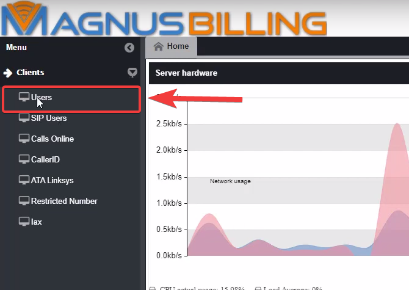
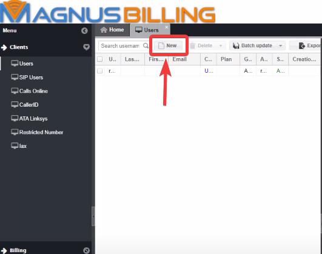
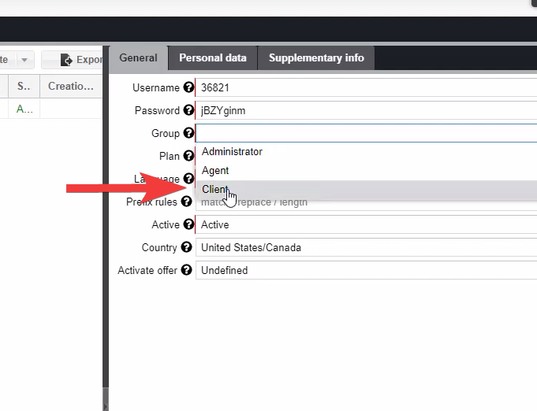
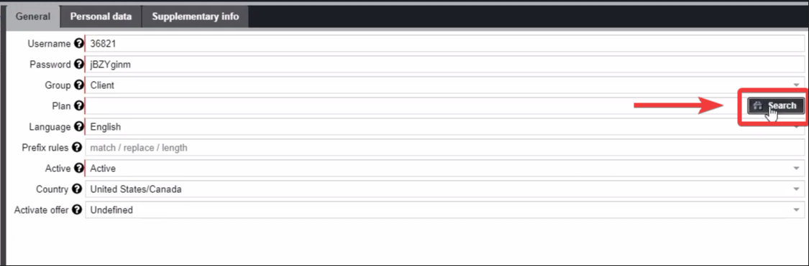
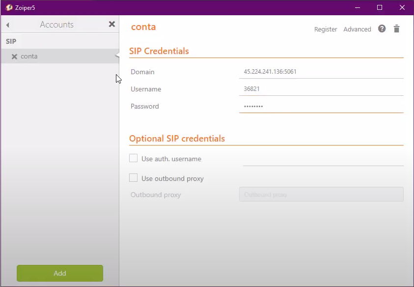

Making your first call
======================

This guide creates a customer, SIP endpoint, plan, provider route, tariff, and
initial balance for a controlled test call.

Before you begin
----------------

Confirm that the installation checks in :doc:`Installation <quick_install>`
pass and that you have valid trunk credentials from a voice provider. Use a
test destination that you are authorized to call.

1. Create a customer and plan
-----------------------------

Sign in to MagnusBilling and open **Customers > Users > New**. Create the
customer and select the customer group.

Open **Rates > Plans > New** and create a plan. Return to the user form and
assign that plan to the customer.

MagnusBilling normally creates a SIP account for the new customer. Open the
SIP Users module and record the generated username and password.

2. Register the SIP endpoint
----------------------------

Configure a SIP client with the generated credentials. Use the MagnusBilling
server IP address as the domain. New MBilling 8 installations use PJSIP and
listen on UDP port ``5060`` by default unless the administrator changed the
transport configuration.

Confirm the endpoint status in the panel and with the Asterisk PJSIP commands
available on the server. Do not continue until registration succeeds.

3. Configure the provider route
-------------------------------

1. Open **Routes > Providers** and create the provider record.
2. Create a trunk with the PJSIP credentials and routing information supplied
   by the provider.
3. Create a trunk group and add the trunk in the desired routing order.

Do not copy a legacy ``chan_sip`` peer unchanged. Translate the provider
settings into PJSIP transport, endpoint, authentication, AOR, identification,
codec, and registration settings as required.

4. Configure destination pricing
--------------------------------

Create the destination prefix and tariff under **Rates**, then associate the
tariff with the customer's plan and the correct trunk group. Review the
:doc:`Tariff selection <../find_rate>` and :doc:`Price calculation <../price_calculation>` guides before using production rates.

5. Add test credit and call
---------------------------

Open **Billing > Refills** and add a small test balance to the customer. Place
a call from the registered endpoint and verify:

* the expected trunk is selected;
* two-way audio and DTMF work;
* the call appears in Calls Online while active;
* the completed CDR contains the expected destination, duration, buy price,
  sell price, and hangup cause;
* the customer balance changes by the expected amount.

If registration succeeds but the call fails, investigate authentication,
number formatting, tariff matching, trunk routing, provider responses, and
firewall/NAT separately. For audio problems, see the
:doc:`no-audio troubleshooting guide <../admin_guide/troubleshooting_no_audio>`.
