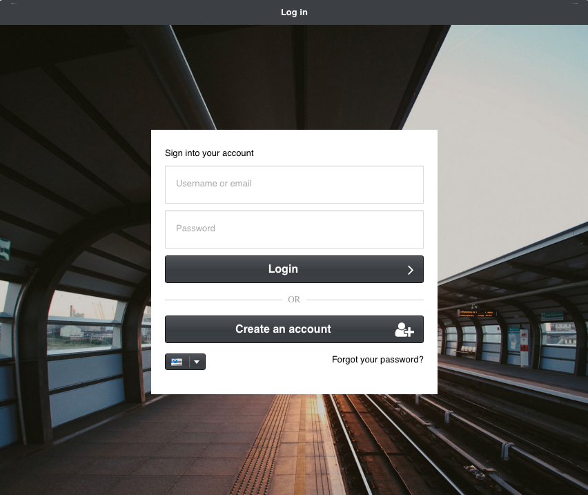

Installation
============

MagnusBilling 8 requires a server running a minimal Debian installation. Use a
dedicated server or virtual machine and make a backup before reinstalling or
upgrading an existing system.

Run the installer
-----------------

Connect to the server through SSH as ``root``, then download and run the
installation script:

::

   wget https://raw.githubusercontent.com/magnussolution/magnusbilling/source/script/install.sh
   bash install.sh

The installer prepares MagnusBilling and its main dependencies, including
Asterisk 20, PJSIP, the web server, PHP, the database service, Fail2ban, and
firewall rules. Follow the prompts displayed in the terminal. The server may
restart when installation is complete.

First login
-----------

After the restart, open the server IP address in a browser:

::

   http://SERVER_IP

Use the initial credentials displayed by the installer. A standard new
installation uses the following panel credentials:

::

   Username: root
   Password: magnus

.. warning::

   Change the default panel password immediately. Restrict administrative and
   SSH access to trusted networks whenever possible.

Verify the installation
-----------------------

Before adding production traffic, verify that:

* the web panel opens and the administrator can sign in;
* the database service is running;
* Asterisk starts and reports version 20;
* PJSIP transports and endpoints load without configuration errors;
* scheduled MagnusBilling commands are present;
* the server firewall allows only the services required by the deployment.

The console configuration reads the database connection from
``/etc/asterisk/res_config_mysql.conf``. If the web panel, scheduled commands,
or AGI calls cannot connect to the database, verify that file before changing
application code.

Important runtime entrypoints
-----------------------------

* ``index.php`` starts the Yii web panel.
* ``cron.php`` runs Yii console commands.
* ``resources/asterisk/mbilling.php`` handles Asterisk AGI call execution.
* ``protected/config/main.php`` contains the web application configuration.
* ``protected/config/cron.php`` contains the console configuration.
* ``script/database.sql`` contains the base database structure.

Continue with :doc:`Making your first call <first_call>` after the installation
checks pass.
